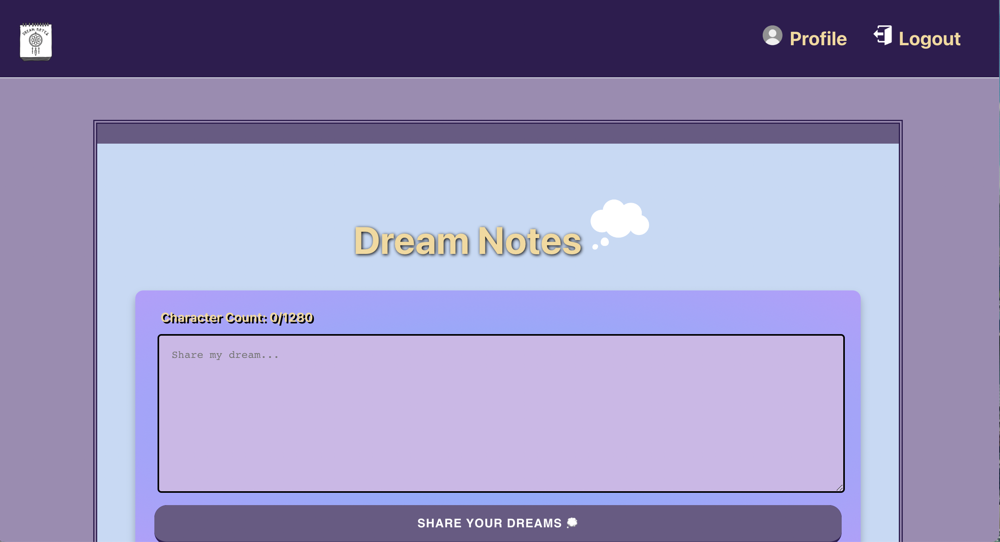
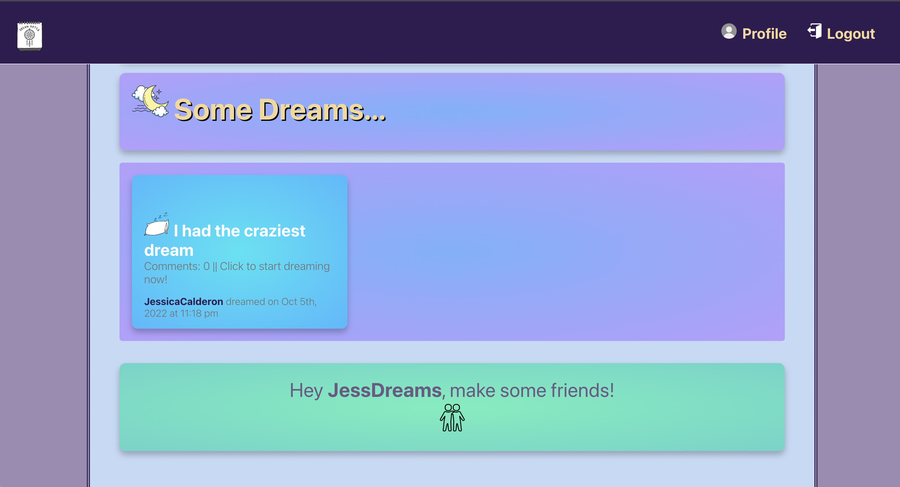
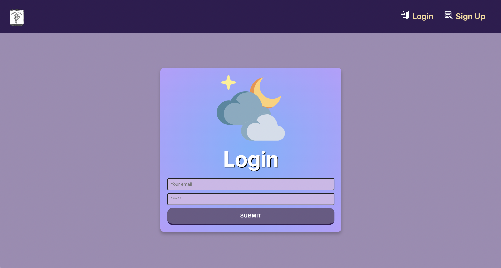
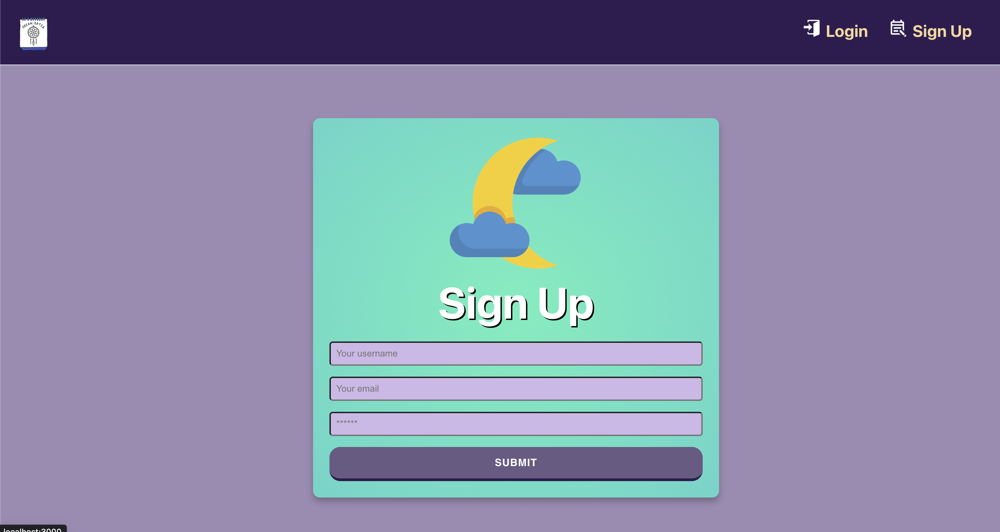
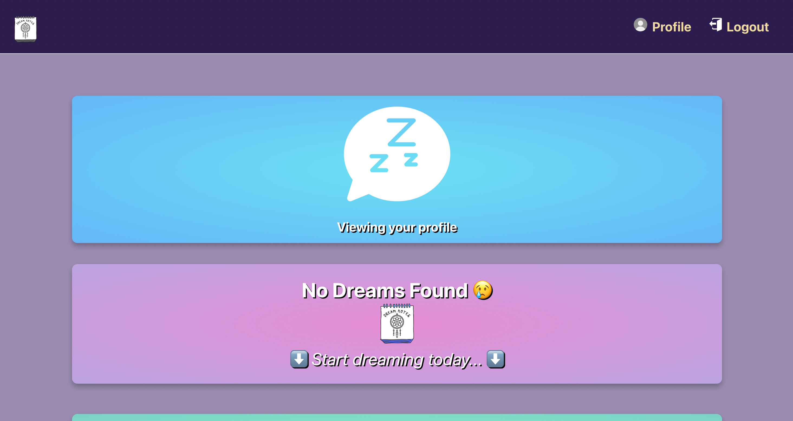
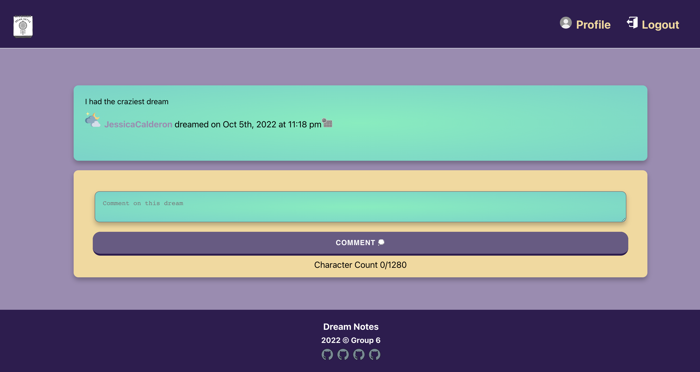

# dream-notes

## Table of Contents

- [User Story](#userstory)
- [Description](#description)
- [Built With](#builtwith)
- [Installation](#installation)
- [Contributions](#Contributions)
- [License](#license)
- [Screenshots](#screenshots)
- [Live Preview](#livepreview)
- [Questions](#questions)
- [Reach Out](#reachout)

## User Story

As a user I want to be able to share my dreams with my friends. I would like to be able to post about my dreams and see comments on those posts. I would also like to search by dream genres to see if others have had similar dreams. I am also looking for a way to add friends and see their dreams.

## Description

A MERN Application which allows users to login and track their dreams. Users can also share their dreams with others and received comments, feedback and support from other users.

Why track your dreams? Studies show dream tracking can help you work through things going on in your life whether you are aware of them or not. Dreams are a window into our subconscious and tell a story only you can truly understand. The problem is we forget them as soon as we wake. Jotting them down as soon as you wake is the best way to capture your dreams and make the most of them. Sharing with you’re your friends and family can offer even more insight.

With our app you can keep a log of all your dreams and only choose to share what you like. Often our dreams are humorous or thrilling and are fun to share. Sometimes they can be scary and haunt us, sharing can help unload the burden and bring them down and ease your mind.

Often times we have recurring dreams and feelings of deja-vu, with our app, you have them ready to review at any time, you can even categorize them for faster searching.

Everyone dreams, most every night. Dreams are like little action movies and really mean something when we remember. Join Dream Notes now to unlock your nightly adventures!!

## Built With

Performant JavaScript
CSS
GraphQL/Apollo
NoSQL/Mongoose
React
Authentication

## Installation

To install dependencies, run the following command:

```
npm i
```

## Contributions

This is a professional platform, lets be kind and respectful of one another!
Pull requests are required!

## License

Apache-2.0
(https://opensource.org/licenses/Apache-2.0)
Apache-2.0
[Link to Apache-2.0 license](https://opensource.org/licenses/Apache-2.0)

## Screenshots







## Live Preview

[Heroku](https://dream-notes-app.herokuapp.com/)

## Questions

You can email questions.

### Reach Out:

GitHub: Anitinky13
Email: ayefanova1@gmail.com

GitHub: Jessica Calderon
Email: calderonjessica13@yahoo.com

GitHub:Wumbo-dot
Email: jtgutierrez.macpark@gmail.com

GitHub: Christys122
Email:mcsalazar122@gmail.com
